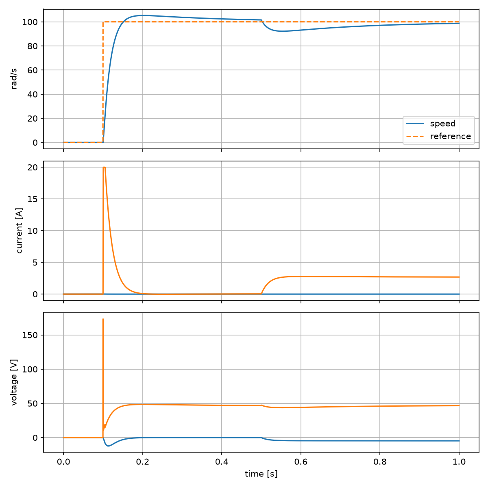

# PMSM Control Digital Twin

A dq-frame permanent-magnet synchronous motor digital twin comparing cascaded PI field-oriented control with constrained one-step predictive current control. The benchmark includes load torque, hot-winding resistance, flux drift, and voltage saturation.



| Nominal result | FOC PI | Predictive |
|---|---:|---:|
| Speed RMSE (% rated) | 4.085% | 4.083% |
| Peak current | 19.90 A | 19.99 A |
| Voltage violations | 0 | 0 |
| Copper loss | 6.193 J | 6.190 J |

## Quick start

```bash
python -m venv .venv && source .venv/bin/activate
pip install -e ".[dev]"
python -m pmsm_twin.simulate --config configs/nominal.yaml
python -m pmsm_twin.benchmark --suite standard
pytest
```

## Original contributions

- Transparent dq electrical and mechanical model with RK4 integration.
- Voltage-disk projection shared by both controllers.
- Matched speed-loop reference generation for a fair current-controller comparison.
- Machine-readable tracking, constraint, copper-loss, and output-energy metrics.

The state/input trace format is aligned with the quantities exposed by [Gym Electric Motor](https://github.com/upb-lea/gym-electric-motor). GEM is an optional validation dependency and is not copied into this repository.

## Acceptance targets

The final tuned benchmark targets speed RMSE below 5% of the 100rad/s rated reference and zero voltage-limit violations while reporting transient and energy metrics for both controllers.

## Limitations

The averaged inverter model omits switching harmonics, iron losses, magnetic saturation, thermal dynamics, and position-sensor errors. It is a digital-twin study, not production drive firmware.
